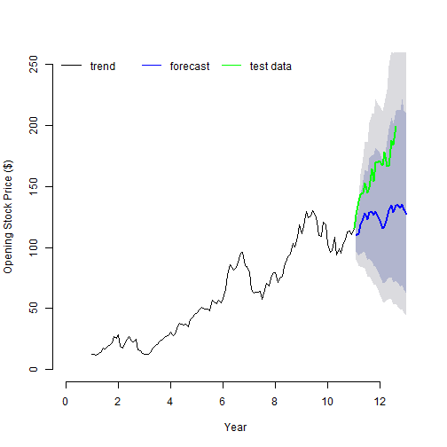

Apple Stock Price Forecast Model
========================================================
author: Gary Stocks
date: 11 August 2018
autosize: true
font-family: 'Helvetica'
transition: rotate

Overview
========================================================

The objective of this model is to forecast the underlying trend in Apple stock prices to use as an input to a decision whether to invest in Apple stock.

This presentation describes how the data is prepared and used to build a forecast model. The interactive Shiny app has been published [here](https://garystocks.shinyapps.io/Assignment/). The full code to build the model can be found on github [here](https://github.com/garystocks/dataproducts3).

The model forecasts an upward trend in the Apple stock price. However, the actual stock prices for the preceding 18 months, used as test data, are much higher than the forecast values. This suggests the model may be under-estimating the price which may be due to short-term factors and would need to be taken into account when deciding on the best time to invest.

Data Preparation
========================================================

The Apple stock data is sourced from Yahoo using the **getSymbols** function in the **quantmod** package. The data imported is the daily pricing for the current year to date and the previous 11 years.

The data is manipulated in the following way:
- Daily data is converted to monthly and the opening monthly price extracted
- The data is converted to time series and an exponential smoothing model applied
- Data for years 1 through 11 is used to train the forecast model
- The remaining data is used to test the model

Forecast Plot
========================================================
<small> The plot shows the forecast opening monthly prices: in black for the training data, in green for the test data (current year to date and previous year), and in blue for the previous 18 months and 6 months ahead. </small>



Analysis
========================================================

The model can be used to forecast future stock prices.

```r
price6m <- round(fcast$mean[24], 2)
price6m
```

```
[1] 127.08
```
The forecast of the Apple opening monthly price for 6 months into the future is $127.08. If Apple stock can be purchased at or near these levels, it may be a worthwhile investment. However, the test data on the forecast plot (green line) shows a much higher price which means other, possibly short-term factors, are influencing the price. Therefore, caution should be used before deciding on such an investment.
